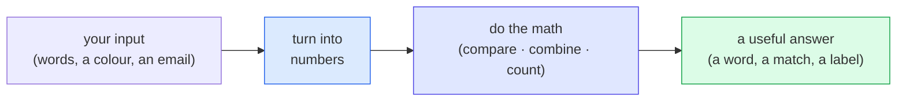

# Qivot AI

**Learn how AI actually works — by building tiny versions of it yourself.**

Every program here is small, runs on your own computer, and does its "thinking" with
nothing but a local database. No accounts, no API keys, no calling out to ChatGPT.
Several lessons are little apps you can click and play with. You don't need to know any
AI — or much code — to follow along.

---

## New to AI? Start here (2-minute read)

AI can feel like magic. It isn't. Here's the honest, plain-English version.

**A computer can't read words or see pictures. It only does math on numbers.** So the
first thing any AI does is turn its input — a sentence, a colour, an email — into
numbers. Everything after that is arithmetic.

Once things are numbers, almost all "AI" boils down to **three simple moves**:

1. **Turn things into numbers.** A word, a colour, a whole message → a list of numbers.
2. **Compare or combine those numbers.** Which two are closest? Add them up. Multiply them
   by other numbers.
3. **Learn the numbers from examples.** Instead of a human setting the rules, the computer
   looks at thousands of examples and counts up the patterns itself.

That's really it. A chatbot like ChatGPT is this same idea — turn words into numbers, do a
*staggering* amount of arithmetic, guess the next word — just enormously bigger. When people
say a model "learned" something, they mean it adjusted a big pile of numbers until they fit
the examples. There's no understanding inside, and no magic. **Once you see the moving parts
on something small, the mystery mostly goes away — and that's what this project is for.**

> A theme you'll notice: in every lesson, the AI's "brain" is just **rows in a database you
> can open and read**. Nothing is hidden.

---

## The four things AI does — and you'll build each one

Almost everything AI does is a version of four basic skills. There's a lesson for each,
and most come as both a read-along terminal version *and* a clickable app.

| The skill | In plain words | Everyday example | Build it |
|-----------|----------------|------------------|----------|
| ✍️ **Write** | Guess the next word, over and over | Phone keyboard suggestions; ChatGPT | [nextword](nextword/) · [app](nextword-app/) |
| 🔍 **Look things up** | Turn things into numbers, find the closest | Search; "find similar" | [findsimilar](findsimilar/) · [app](findsimilar-app/) |
| 🔢 **Crunch numbers** | Multiply numbers by a grid of weights | The math inside every neural network | [tensor](tensor/) · [app](tensor-app/) |
| ⚖️ **Decide** | Learn from labelled examples, then sort | Spam filters; yes/no answers | [classify](classify/) · [app](classify-app/) |



---

## Where to start

- **Just want to *see* it?** Open a clickable app first — [nextword-app](nextword-app/)
  (watch it write, one word at a time) or [tensor-app](tensor-app/) (drag some sliders and
  watch a neural layer compute).
- **Want it explained from scratch?** Read [nextword](nextword/) — the friendliest starting
  point — then [findsimilar](findsimilar/), [tensor](tensor/), and [classify](classify/).
- Each lesson's README is plain English with diagrams, and the `tensor` and `classify`
  READMEs walk through the actual code line by line.

---

## All the lessons

| Folder | What you build | The idea it teaches |
|--------|----------------|---------------------|
| [**nextword**](nextword/) | A "guess the next word" writer (terminal) | How a chatbot writes: guess the next word, over and over. Its whole "brain" is just rows in a table. |
| [**nextword-app**](nextword-app/) | The same model as a clickable **app** | Press Play and watch it write — and watch the choices and dice-rolls happen live. |
| [**findsimilar**](findsimilar/) | A step-by-step "search by meaning" tool | How AI looks things up: turn text into numbers, then find the closest numbers. |
| [**findsimilar-app**](findsimilar-app/) | The search as a clickable **app** | Type and watch notes re-sort with animated bars, and see *why* the winner matched. |
| [**tensor**](tensor/) | One neural-network layer, by hand | What AI is literally made of: "tensors" (boxes of numbers) and one move — multiply by a grid. |
| [**tensor-app**](tensor-app/) | The layer as a clickable **app** | Move R/G/B sliders and watch the grid, the multiply-add, and the outputs recompute live. |
| [**classify**](classify/) | A junk-mail detector, learned from examples | How AI *decides*: count which words lean which way, then add up the evidence. |
| [**classify-app**](classify-app/) | The detector as a clickable **app** | Type a message and watch the verdict, the meter, and the per-word evidence bars. |

---

## What you need

- **Qt** 5.15 or 6 (with `qmake`) — the toolkit these are built with.
- The **[`qivot`](../qivot)** library checked out right next to this folder:

  ```
  dev/
    qivot/        # the database library the lessons build on
    qivot-ai/     # this project
  ```

## Build & run

```bash
cd qivot-ai
qmake && make               # builds every lesson
./nextword/nextword         # run a terminal lesson
./tensor-app/tensorapp      # run an app
```

Or build a single lesson from inside its own folder — see that folder's README.

---

## Common questions

**Do I need to know AI already?** No. That's the whole point — you'll learn the basics by
building them.

**Do I need to be good at C++?** Not really. You can run everything and read the plain-English
walkthroughs without touching code. If you *do* read the code, it's short and commented.

**Is this how ChatGPT works?** It's the same *ideas* — turn things into numbers, do math,
learn from examples — at a tiny, readable scale. The real thing is millions of times bigger,
but the shape is what you'll build here.

## Why build it all on a database?

A surprising amount of "AI" is really just **storing things and looking them up cleverly** —
counts, word lists, numbers that measure how alike two things are. A database is the perfect
tool for that. So [Qivot](../qivot) handles the storage in a line or two, each lesson stays
short, and your attention stays on the *idea*. And it means the "brain" is always something you
can open and read — just rows in a table.
