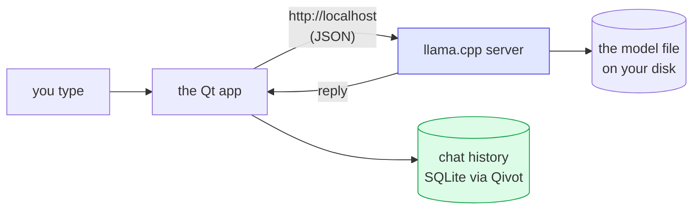

# Local Chatbot — a real model, running on your machine

> **Bonus lesson** · [Qivot AI](../README.md). Unlike lessons 1–4, this one does **not** build
> the brain from scratch — it **downloads a real, pre-trained model** and runs it locally. The
> honest "here's the magic actually working" bookend to the "here's how the magic works" lessons.

A desktop chat app backed by a small open-source model (**Qwen2.5-0.5B**) running **entirely on
your computer** via [llama.cpp](https://github.com/ggml-org/llama.cpp). No account, no API key,
no internet once the model is downloaded. Your conversation is saved in SQLite through Qivot, so
it's still there next time you open it.


## What it can and can't do

It's a **0.5-billion-parameter** model — tiny, as these things go. So, honestly:

- ✅ Holds a conversation, explains things, rewrites/summarizes text, brainstorms, writes a silly poem.
- ⚠️ **Makes facts up** — the screenshot above calls the ocean "the largest living organism on
  Earth," which is nonsense. Don't trust small models on specifics.
- ⚠️ Weak at math and careful reasoning; knows nothing recent; no web access.

Think "a chatty, eager intern who's sometimes confidently wrong" — not ChatGPT. Want it smarter?
Point it at a bigger model (see *Configuration* below); it'll be slower but more coherent.

## How it works



1. On launch, the app **starts a local llama.cpp server** pointed at the model file (it offloads
   the model to your Mac's GPU, so it's fast).
2. Each message you send is POSTed to that server at `http://127.0.0.1:8080`; the reply comes back
   as JSON.
3. Every message — yours and the model's — is **saved as a row in SQLite through Qivot**, so
   history persists. That's the genuine Qivot tie-in: *the model does the talking, Qivot does the
   remembering.*

## Set it up

From a clean checkout you need two one-time downloads (llama.cpp, and the model), then build:

```bash
# 1. Build llama.cpp as a sibling of qivot-ai  (dev/llama.cpp)
git clone --depth 1 https://github.com/ggml-org/llama.cpp ../../llama.cpp
cmake -S ../../llama.cpp -B ../../llama.cpp/build -DCMAKE_BUILD_TYPE=Release
cmake --build ../../llama.cpp/build -j

# 2. Download the model (~491 MB) into ./models
mkdir -p models
curl -L -o models/qwen2.5-0.5b-instruct-q4_k_m.gguf \
  https://huggingface.co/Qwen/Qwen2.5-0.5B-Instruct-GGUF/resolve/main/qwen2.5-0.5b-instruct-q4_k_m.gguf

# 3. Build and run the app
qmake && make
./chatbotapp
```

The app finds llama-server at `../../llama.cpp/build/bin/llama-server` and the model at
`./models/…` by default. First launch takes a few seconds to load the model into memory; the dot
in the header goes green when it's ready.

## Configuration

Override the defaults with environment variables — e.g. to try a bigger, smarter model:

```bash
export LLAMA_MODEL=/path/to/Llama-3.2-3B-Instruct-Q4_K_M.gguf
export LLAMA_SERVER=/path/to/llama.cpp/build/bin/llama-server   # if it's elsewhere
./chatbotapp
```

## The code, briefly

- [`chatservice.cpp`](chatservice.cpp) — the backend. It launches the server (`QProcess`), polls
  `/health` until the model is loaded, POSTs your conversation to `/v1/chat/completions`, and
  saves each message with `Message::save()`.
- [`message.h`](message.h) — the one-line Qivot model for a stored chat line.
- [`main.qml`](main.qml) — the chat window. It only draws `chat.messages` and calls `chat.send()`.

## Honest place in the project

The other lessons are the honest, from-scratch teaching. This one is the counterpart: a *real*
model, so you can feel the difference between the toy you understand and the real thing that works
— and see that even a real one is just next-word-prediction, trained by someone with a data center
and handed to you as a file.
