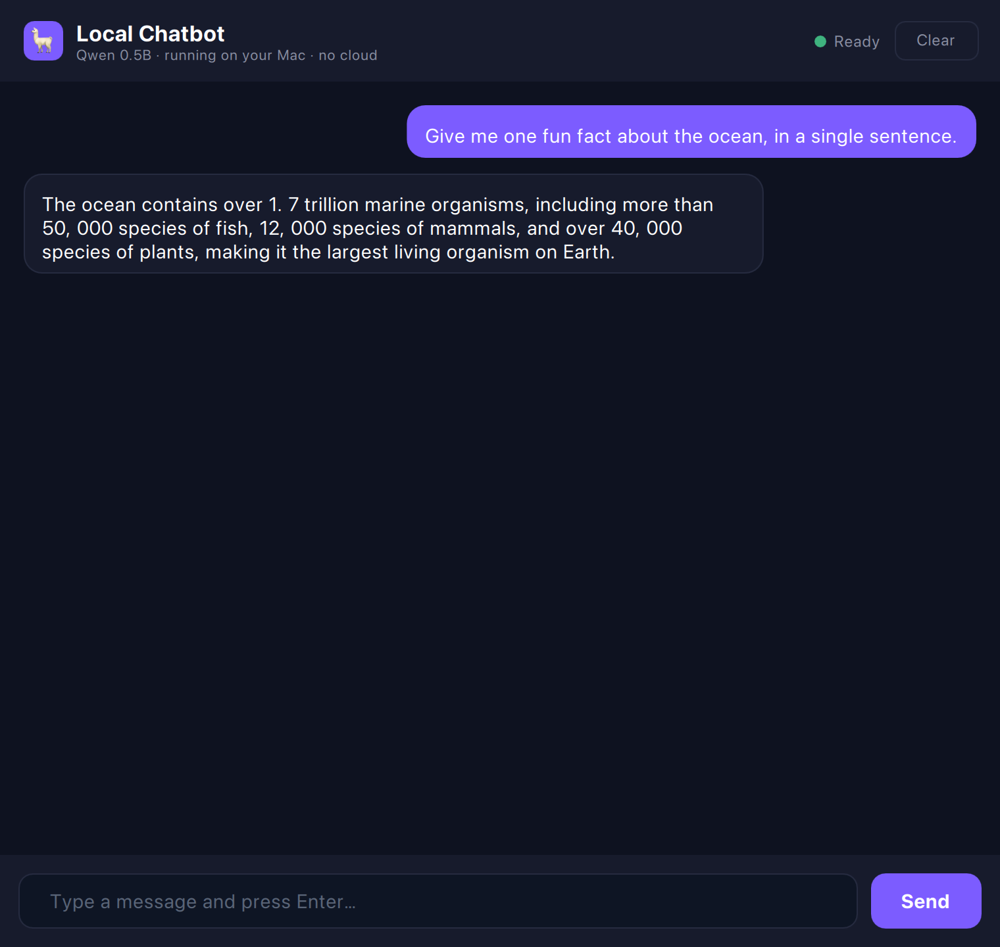
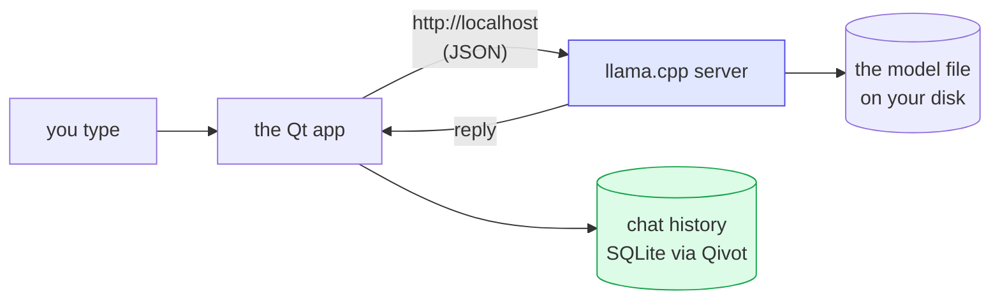
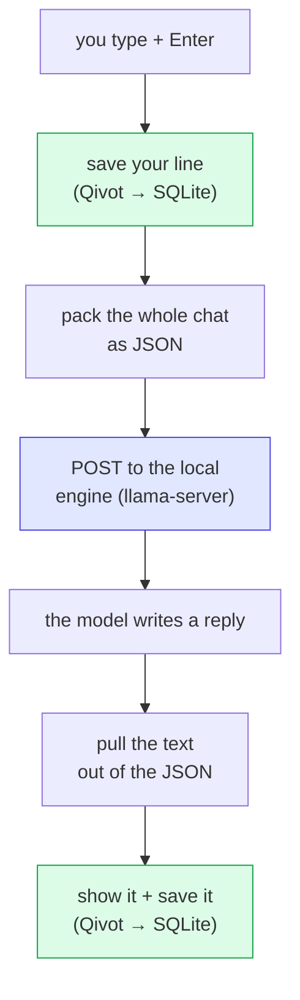

# Local Chatbot — a real model, running on your machine

> **Bonus lesson** · [Qivot AI](../README.md). Unlike lessons 1–4, this one does **not** build
> the brain from scratch — it **downloads a real, pre-trained model** and runs it locally. The
> honest "here's the magic actually working" bookend to the "here's how the magic works" lessons.

A desktop chat app backed by a small open-source model (**Qwen2.5-0.5B**) running **entirely on
your computer** via [llama.cpp](https://github.com/ggml-org/llama.cpp). No account, no API key,
no internet once the model is downloaded. Your conversation is saved in SQLite through Qivot, so
it's still there next time you open it.



## What it can and can't do

It's a **0.5-billion-parameter** model — tiny, as these things go. So, honestly:

- ✅ Holds a conversation, explains things, rewrites/summarizes text, brainstorms, writes a silly poem.
- ⚠️ **Makes facts up** — the screenshot above calls the ocean "the largest living organism on
  Earth," which is nonsense. Don't trust small models on specifics.
- ⚠️ Weak at math and careful reasoning; knows nothing recent; no web access.

Think "a chatty, eager intern who's sometimes confidently wrong" — not ChatGPT. Want it smarter?
Point it at a bigger model (see *Configuration* below); it'll be slower but more coherent.

## How it works



1. On launch, the app **starts a local llama.cpp server** pointed at the model file (it offloads
   the model to your Mac's GPU, so it's fast).
2. Each message you send is POSTed to that server at `http://127.0.0.1:8080`; the reply comes back
   as JSON.
3. Every message — yours and the model's — is **saved as a row in SQLite through Qivot**, so
   history persists. That's the genuine Qivot tie-in: *the model does the talking, Qivot does the
   remembering.*

## Set it up

From a clean checkout you need two one-time downloads (llama.cpp, and the model), then build:

```bash
# 1. Build llama.cpp as a sibling of qivot-ai  (dev/llama.cpp)
git clone --depth 1 https://github.com/ggml-org/llama.cpp ../../llama.cpp
cmake -S ../../llama.cpp -B ../../llama.cpp/build -DCMAKE_BUILD_TYPE=Release
cmake --build ../../llama.cpp/build -j

# 2. Download the model (~491 MB) into ./models
mkdir -p models
curl -L -o models/qwen2.5-0.5b-instruct-q4_k_m.gguf \
  https://huggingface.co/Qwen/Qwen2.5-0.5B-Instruct-GGUF/resolve/main/qwen2.5-0.5b-instruct-q4_k_m.gguf

# 3. Build and run the app
qmake && make
./chatbotapp
```

The app finds llama-server at `../../llama.cpp/build/bin/llama-server` and the model at
`./models/…` by default. First launch takes a few seconds to load the model into memory; the dot
in the header goes green when it's ready.

## Configuration

Override the defaults with environment variables — e.g. to try a bigger, smarter model:

```bash
export LLAMA_MODEL=/path/to/Llama-3.2-3B-Instruct-Q4_K_M.gguf
export LLAMA_SERVER=/path/to/llama.cpp/build/bin/llama-server   # if it's elsewhere
./chatbotapp
```

## The full C++ tour — how it all works, step by step

Here's the honest secret of this whole app: **it's just a messenger.** The AI lives in a separate
program (the model server); our C++ carries your words over to it and carries the reply back — and
writes everything down in a notebook (SQLite) so nothing is forgotten.

There are only three files that matter, and we'll walk the key parts of each (snippets are
trimmed a little for readability — the complete code is in the files themselves):

| File | Its job, in a phrase |
|------|----------------------|
| [`message.h`](message.h) | describes one saved line of chat |
| [`main.cpp`](main.cpp) | opens the notebook and starts everything |
| [`chatservice.cpp`](chatservice.cpp) | the messenger — starts the model, sends, receives, saves |

---

### Step 1 · Describe one line of the conversation

Before we can *save* chat, we tell Qivot what a saved line looks like. That's this tiny class —
and from it, Qivot builds a database table for us, no SQL required:

```cpp
class Message : public QiModel {
    QI_MODEL
public:
    QiField<int>     role;       // 0 = you, 1 = the assistant
    QiField<QString> text;       // what was said
    QiField<QString> createdAt;  // when
};
QI_DECLARE_MODEL(Message, "message",
    QI_FIELD(role), QI_FIELD(text), QI_FIELD(createdAt));
```

That's the whole "memory." Every line you or the model says becomes one row like this.

### Step 2 · Open the notebook (in `main.cpp`)

When the app starts, we open a real database file and tell Qivot to make sure the `message` table
exists. That file is why your conversation is still there next time you open the app:

```cpp
QSqlDatabase db = QSqlDatabase::addDatabase("QSQLITE");
db.setDatabaseName("chat.db");                 // a real file next to the app
db.open();

QiConnection connection;
connection.open(db);
connection.addModel<Message>();                // "here's my table"
connection.createTables();                     // make it if it's not there yet
```

Then we hand control to the messenger and show the window:

```cpp
ChatService chat;                              // the messenger (does everything below)
engine.rootContext()->setContextProperty("chat", &chat);
engine.load(QUrl("qrc:/main.qml"));            // the chat window
```

### Step 3 · Start the model's engine

The AI runs in its **own separate program** (`llama-server`). Our app starts it in the background,
pointing it at the downloaded model file — like flipping on an engine that quietly idles, waiting
for questions:

```cpp
m_server = new QProcess(this);
m_server->start(bin, { "-m", model,            // the model file
                       "--host", "127.0.0.1",  // only your machine can reach it
                       "--port", "8080",        // the "door number" we'll talk through
                       "-c", "4096",            // how much it can remember at once
                       "-ngl", "99" });         // run it on the GPU = fast
```

Nothing here talks to the internet — `127.0.0.1` is your own computer talking to itself.

### Step 4 · Wait for it to warm up

Loading half a gigabyte of model into memory takes a few seconds. So the app **politely asks the
engine "ready yet?"** every ¾ second until it says yes — then turns the status dot green:

```cpp
void ChatService::checkHealth() {
    QNetworkReply *reply = m_net.get(request("http://127.0.0.1:8080/health"));
    connect(reply, &QNetworkReply::finished, this, [this, reply] {
        if (reply->readAll().contains("ok")) {   // the model finished loading
            m_health.stop();                      // stop asking
            setReady(true);                       // light turns green
        }
    });
}
```

(A repeating timer calls this over and over. That "do a thing every so often" pattern is called
*polling*.)

### Step 5 · You hit Enter — send the message

This is the heart of it. When you send a message, four things happen in order:

```cpp
void ChatService::send(const QString &text) {
    addMessage(0, text, true);          // 1. show + save YOUR message
    setBusy(true);                      //    (the "typing…" state)

    QJsonArray msgs;                    // 2. pack up the whole conversation as JSON
    // a quiet instruction the model sees but you don't:
    msgs.append(systemMessage("You are a helpful, friendly assistant…"));
    for (past message : m_messages)     // include the history so it remembers context
        msgs.append({ role, content });

    QJsonObject body;
    body["messages"] = msgs;
    body["stream"]   = false;           // send the whole reply at once

    // 3. hand it to the engine at the door (port) we opened
    QNetworkReply *reply = m_net.post(chatUrl, QJsonDocument(body).toJson());

    connect(reply, &QNetworkReply::finished, this, [this, reply] {
        // 4. when the reply arrives, dig the text out and show + save it
        QJsonObject obj = QJsonDocument::fromJson(reply->readAll()).object();
        QString answer = obj["choices"].toArray().first().toObject()
                              ["message"].toObject()["content"].toString();
        addMessage(1, answer, true);
        setBusy(false);
    });
}
```

Two things worth noticing:

- **We send the *whole* history every time.** The model has no memory of its own — so to have a
  real back-and-forth, we re-hand it the entire conversation on every turn. *That's* how a chatbot
  "remembers" what you said three messages ago.
- **The "system" message** is a quiet coaching note (be helpful, be concise) the model follows but
  never shows you.

### Step 6 · Save every line (the Qivot part)

Both `addMessage(...)` calls above do two jobs: pop the line onto the screen, *and* write it into
the notebook so it survives a restart:

```cpp
void ChatService::addMessage(int role, const QString &text, bool persist) {
    QVariantMap m; m["role"] = role; m["text"] = text;
    m_messages.append(m);
    emit messagesChanged();            // the window redraws with the new line

    if (persist) {                     // write one row into SQLite
        Message row;
        row.role = role;
        row.text = text;
        row.createdAt = QDateTime::currentDateTime().toString(Qt::ISODate);
        row.save();                    // <-- Qivot writes it to disk
    }
}
```

### Step 7 · Remember it next time

And when the app opens, it reads all those rows back so your old conversation is waiting for you:

```cpp
QiList<Message> rows = QiQuery<Message>().orderBy("id asc").all();  // oldest first
for (Message *row : rows)
    m_messages.append({ row->role, row->text });
```

---

### The journey of one message, start to finish



And the window itself? It has **zero** logic — [`main.qml`](main.qml) just draws `chat.messages`
and calls `chat.send()` when you press Enter. Every bit of the work above lives in the C++.

That's the entire app: **describe a line → open the notebook → start the engine → wait → send →
receive → save.** A messenger with a good memory.

## Honest place in the project

The other lessons are the honest, from-scratch teaching. This one is the counterpart: a *real*
model, so you can feel the difference between the toy you understand and the real thing that works
— and see that even a real one is just next-word-prediction, trained by someone with a data center
and handed to you as a file.
