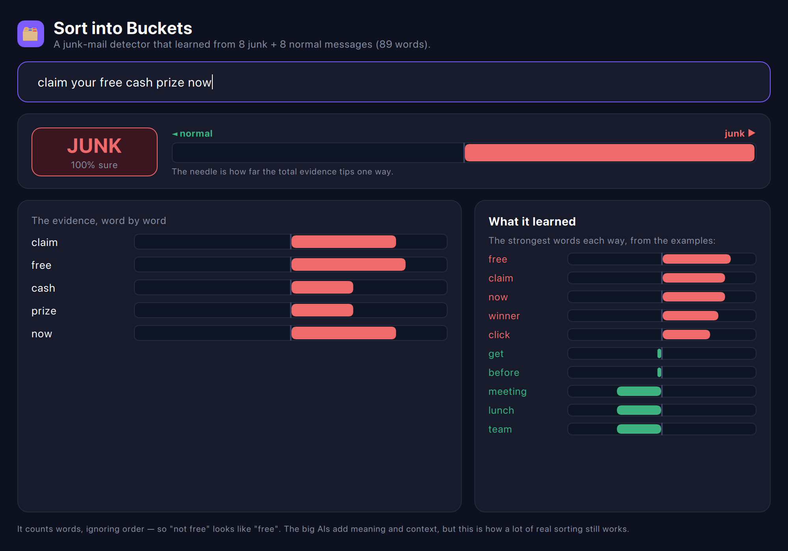
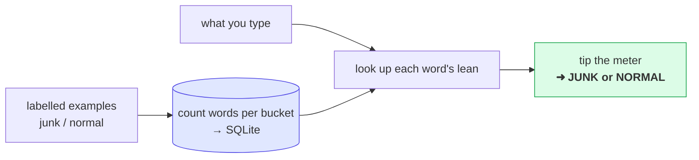

# Sort into Buckets — the interactive app

The **visual version** of the [`classify`](../classify) lesson. Type a message and watch a
junk-mail detector make up its mind in real time — a verdict badge, a **normal ↔ junk meter**,
and a per-word **evidence chart** showing which words pushed which way.

> New to the idea? Read the [`classify` tutorial](../classify/README.md) first — it explains the
> method (Naive Bayes) from scratch. This is the same brain with a face on it.



## What you're looking at

- **The verdict badge** — JUNK (red) or NORMAL (green), with how confident it is.
- **The meter** — the total evidence, tipped left (normal) or right (junk).
- **The evidence chart** — every word in your message as a diverging bar: right/red = leans junk,
  left/green = leans normal. This is the model "thinking," one word at a time.
- **What it learned** — the strongest words each way, worked out purely from the examples.

Type `lunch on friday with the team` and it swings to **NORMAL**. Type `free prize winner` and it
slams to **JUNK**. Nothing understands the words — it's just adding up leanings.

---

## How it works (the 10-second version)



---

## The code, step by step

The window has **no logic** — it only draws numbers. Everything happens in the C++ backend
[`classifier.cpp`](classifier.cpp). Here's the real code in run order.

### Step 1 — Learn: tally each word per bucket

```cpp
QHash<QString, QVector<int>> m_cnt;        // m_cnt[word] = { normalCount, junkCount }

auto learn = [&](const char *msg, int cls) {
    for (const QString &w : words(QString::fromUtf8(msg))) {
        if (!m_cnt.contains(w)) m_cnt[w] = QVector<int>{ 0, 0 };
        m_cnt[w][cls]++;                   // one tick for this word, this bucket
        m_totalWords[cls]++;
    }
};
for (int i = 0; i < kNormalCount; i++) learn(kNormal[i], 0);
for (int i = 0; i < kJunkCount;   i++) learn(kJunk[i],   1);
```

"Training" is literally counting. That's the learning.

### Step 2 — Save the counts into SQLite (the persistent brain)

```cpp
QiTransaction tx;
for (auto it = m_cnt.constBegin(); it != m_cnt.constEnd(); ++it)
    for (int c = 0; c < 2; c++)
        if (it.value()[c] > 0) {
            WordCount wc; wc.word = it.key(); wc.cls = c; wc.n = it.value()[c];
            wc.save();                     // one row per (word, bucket)
        }
tx.commit();
```

### Step 3 — Turn a count into a probability (`logP`)

```cpp
double Classifier::logP(int cls, int wordCount) const {
    return std::log((wordCount + 1.0) / (m_totalWords[cls] + m_V));  // the +1 = "smoothing"
}
```

`P(word | bucket)`. The **+1** stops a never-before-seen word from zeroing the whole score.

### Step 4 — How strongly does a word lean? (`leanOf`)

```cpp
double Classifier::leanOf(const QString &w) const {
    const QVector<int> c = m_cnt.value(w, QVector<int>{ 0, 0 });
    const double l = logP(1, c[1]) - logP(0, c[0]);      // junk-ness minus normal-ness
    return std::max(-1.0, std::min(1.0, l / 2.5));       // clamp to [-1, 1] for the bar
}
```

**Subtracting the two logs is the same as dividing the two probabilities** (`log(a) − log(b) = log(a/b)`),
so this single number answers *"how many times more junky than normal is this word?"* Positive means
junkier (bar leans right, red); negative means more normal (left, green). It **is** each bar you see.

> New to why we take logs and add a `+1`? The [classify tutorial](../classify/README.md) breaks the
> probability math down piece by piece (steps 3–5).

### Step 5 — Score the message live (runs on every keystroke)

```cpp
void Classifier::recompute() {
    const QStringList qw = words(m_message);
    double score[2] = { log(normalPrior), log(junkPrior) };

    for (const QString &w : qw) {
        const QVector<int> c = m_cnt.value(w, QVector<int>{ 0, 0 });
        score[0] += logP(0, c[0]);                       // evidence toward normal
        score[1] += logP(1, c[1]);                       // evidence toward junk
        QVariantMap m; m["word"] = w; m["lean"] = leanOf(w);
        m_evidence << m;                                 // <-- QML draws this
    }

    m_pJunk = 1.0 / (1.0 + std::exp(score[0] - score[1]));   // 0..1, drives the meter
    m_verdict = (m_pJunk >= 0.5) ? "JUNK" : "NORMAL";
    emit changed();                                      // tell the window to redraw
}
```

### Step 6 — QML just binds to the results

```qml
Text { text: clf.verdict }                       // the badge
DivBar { lean: (clf.pJunk - 0.5) * 2 }           // the meter
Repeater {                                        // the evidence chart
    model: clf.evidence
    delegate: DivBar { lean: modelData.lean }
}
```

Every property the window reads (`clf.verdict`, `clf.pJunk`, `clf.evidence`) is filled in by
`recompute()`. No math lives in the UI.

> **A QML gotcha worth knowing:** the backend is exposed as **`clf`**. Don't name a context object
> `layer` — every QML `Item` already has a built-in `layer` property (graphics effects), so it gets
> shadowed and silently reads as `undefined`. (Learned that the hard way on the tensor app.)

---

## Run it

```bash
cd classify-app
qmake && make
./classifyapp
```

(Needs Qt 5.15 or 6 with QML, and the sibling [`qivot`](../../qivot) repo next door.)

## Make it yours

- **Change the buckets.** Swap the messages in [`corpus.h`](corpus.h) for happy vs angry reviews,
  work vs personal email, anything. Rebuild — the app becomes that sorter, no other changes.
- **Watch a word flip.** Add "free" to a few normal examples and watch its bar swing back toward the
  middle. That's the model changing its mind as the evidence changes.

## The honest part

It counts words and ignores order, so *"not free money"* looks the same as *"free money"*. Real text
AIs fix that with **meaning** ([findsimilar](../findsimilar)) and **context** ([nextword](../nextword)).
But this counting-and-adding is genuinely how a lot of real-world sorting still works — and it's the
clearest possible look at how a model "learns from labelled examples."
