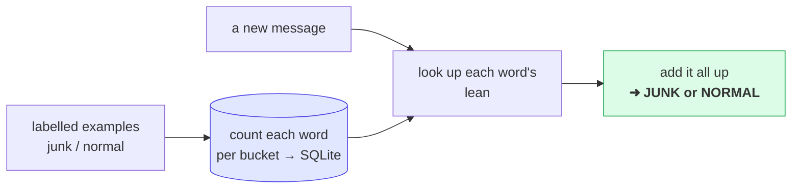

# Sort into Buckets — how an AI *decides*

> **Lesson 4 of 4** · [Qivot AI](../README.md) — the capstone. Uses counting (from [nextword](../nextword/)) plus a little probability.

Spam filters, "is this review positive or negative," "which folder does this email go in" —
a huge amount of AI is just **sorting things into buckets**. This lesson builds a junk-mail
detector from scratch and shows exactly how it makes up its mind.

The trick, in one line:

> Show it **labelled examples** (these are junk, these are normal). It counts which words
> lean which way. Then for a new message, it adds up the leanings and picks a side.

No understanding. Just counting and adding. (The method is a classic called **Naive Bayes**.)

---

## The whole idea in one picture



---

## Watch it work

**Step 1 — Learn from labelled examples.** We hand it 8 junk + 8 normal messages. It counts
every word in each bucket. That's the "training."

**Step 2 — Which words lean which way?** From those counts, each word gets a leaning:

```
                    normal <----------|----------> junk
     free                     |█████████
     claim                    |████████
     winner                   |███████
     lunch              ██████|
     meeting            ██████|
```

*"free" and "claim" scream junk; "lunch" and "meeting" say normal.* Nobody told it that — it
worked it out from the examples.

**Step 3 & 4 — A new message, weighed word by word:**

```
     "congratulations claim your free cash prize winner click now"

                    normal <----------|----------> junk
     claim                    |████████
     free                     |█████████
     cash                     |█████
     winner                   |███████
     now                      |████████

     VERDICT:  JUNK   (100% sure)
```

Try a normal one and it flips:

```
./classify can we meet for lunch on friday     →  VERDICT: NORMAL (95% sure)
```

---

## Run it

```bash
cd classify
qmake && make
./classify                               # a default junky message   → JUNK
./classify can we meet for lunch friday  # → NORMAL
./classify free cash prize click now     # → JUNK
```

---

## The Qt/C++ code, step by step

Real code from [`models.h`](models.h) and [`main.cpp`](main.cpp), in run order.

### Step 0 — One row per (word, bucket) count

```cpp
class WordCount : public QiModel {
    QI_MODEL
public:
    QiField<QString> word;
    QiField<int>     cls;   // 0 = normal, 1 = junk
    QiField<int>     n;     // times this word appeared in that bucket
};
QI_DECLARE_MODEL(WordCount, "wordcount",
    QI_FIELD(word), QI_FIELD(cls), QI_FIELD(n));
```

The learned "brain" is nothing but these rows — `free / junk / 6`, `meeting / normal / 3`, …

### Step 1 — Learn: count words in each bucket

```cpp
QHash<QString, QVector<int>> cnt;          // cnt[word] = { normalCount, junkCount }
int totalWords[2] = { 0, 0 };

auto learn = [&](const char *msg, int cls) {
    for (const QString &w : words(QString::fromUtf8(msg))) {
        if (!cnt.contains(w)) cnt[w] = QVector<int>{ 0, 0 };
        cnt[w][cls]++;                     // tally this word for this bucket
        totalWords[cls]++;
    }
};
for (int i = 0; i < kNormalCount; i++) learn(kNormal[i], 0);
for (int i = 0; i < kJunkCount;   i++) learn(kJunk[i],   1);
```

"Training" is literally tallying. That's the whole learning step.

### Step 2 — Save those counts into SQLite

```cpp
QiTransaction tx;
for (auto it = cnt.constBegin(); it != cnt.constEnd(); ++it)
    for (int c = 0; c < 2; c++)
        if (it.value()[c] > 0) {
            WordCount wc; wc.word = it.key(); wc.cls = c; wc.n = it.value()[c];
            wc.save();                     // one row per (word, bucket)
        }
tx.commit();
```

### Step 3 — Turn a count into a "how likely" number

This is the one line with real math in it, so let's go slowly. It answers: *if a message is junk,
how likely is it to contain this word?*

```cpp
auto logP = [&](int cls, int wordCount) {
    return std::log( (wordCount + 1.0) / (totalWords[cls] + V) );
};
```

Read it in three pieces:

**3a · A fraction is a probability.** `wordCount / totalWords[bucket]` just means *"out of all the
words in this bucket, what share is this one?"* If "free" shows up 6 times and the junk bucket has ~70
words total, that's 6 / 70 ≈ 0.09 — "free" is about 9% of junk words. That share **is** the probability.

**3b · The `+1` (called "smoothing").** What about a word that never appeared in a bucket? Its share
would be 0 — and since we'll be combining many of these, one zero would wipe out everything. So we
pretend we saw every word one extra time: `(wordCount + 1) / (totalWords + V)`, where `V` is how many
different words exist. Now nothing is ever exactly zero. That's the whole trick.

**3c · Why the `log(...)`?** To score a whole sentence we'd have to *multiply* a lot of small
fractions, and tiny × tiny × tiny quickly shrinks to basically zero (computers lose the number). A
**logarithm** has one handy property: `log(a × b) = log(a) + log(b)`. So taking the log lets us **add**
instead of multiply — same ranking, no vanishing. That's the only reason it's here.

> **What's a log, in one line?** A tool that turns multiplying into adding. You don't need more than
> that to follow this.

### Step 4 — Score a new message: add up the evidence

Now sorting a message is easy. Keep a running total for each bucket, and for every word add its
"how likely" number (from Step 3) to *both* buckets:

```cpp
double score[2] = { log(normalPrior), log(junkPrior) };   // 4a. start roughly even
for (const QString &w : words(query)) {
    QiList<WordCount> rows = QiQuery<WordCount>()
        .filter(QiWhere("word = ", w)).all();             // 4b. ask the DB for this word
    int wc[2] = { 0, 0 };
    for (int k = 0; k < rows.size(); k++)
        wc[int(rows.at(k)->cls)] = int(rows.at(k)->n);

    score[0] += logP(0, wc[0]);   // 4c. add this word's evidence toward "normal"
    score[1] += logP(1, wc[1]);   //     ...and toward "junk"
}
```

- **4a · Start even.** `normalPrior` / `junkPrior` is just *"before reading any words, how common is
  each bucket?"* — here 8 examples each, so basically a tie.
- **4b · Look each word up.** One query per word pulls its counts out of SQLite.
- **4c · Add, don't decide yet.** Each word nudges *both* totals. A junky word like "free" adds a lot
  more to the junk total than the normal total — that gap is the evidence piling up.

### Step 5 — Decide, and say how sure

After the last word, compare the two totals. `exp(...)` just undoes the `log` from Step 3 to turn the
gap between the totals back into a plain 0–1 chance:

```cpp
const double pJunk = 1.0 / (1.0 + std::exp(score[0] - score[1]));  // 0 = normal … 1 = junk
const bool   junk  = pJunk >= 0.5;
```

Whichever total is higher wins; how far apart they were becomes the confidence.

**That's the whole classifier:** count words per bucket → store → for a new message, add up each
word's evidence → pick the bigger side.

---

## The honest part

This counts words one at a time and ignores order, so *"not free money"* and *"free money"* look
the same to it. Real text AIs fix that with the tricks from the other lessons — word **meaning**
([findsimilar](../findsimilar)) and **context** ([nextword](../nextword)) — but the core idea you
just saw is exactly how a huge amount of real classification still works, and how every model
"learns from labelled examples."

## Make it yours

- **Change the buckets.** Replace the messages in [`corpus.h`](corpus.h) with, say, happy vs angry
  reviews. Rebuild — now it's a mood detector. Same code.
- **Add more examples** and watch shaky words firm up their lean.
- **Read the brain:** `sqlite3 classify.db "SELECT * FROM wordcount WHERE word='free';"`

## What Qivot is doing here

The counts are ordinary rows ([`models.h`](models.h)); saving is `wc.save()`, and scoring a message
is one query per word: `QiQuery<WordCount>().filter(QiWhere("word = ", w)).all()`. The AI idea stays
in front; the storage is a couple of lines.
