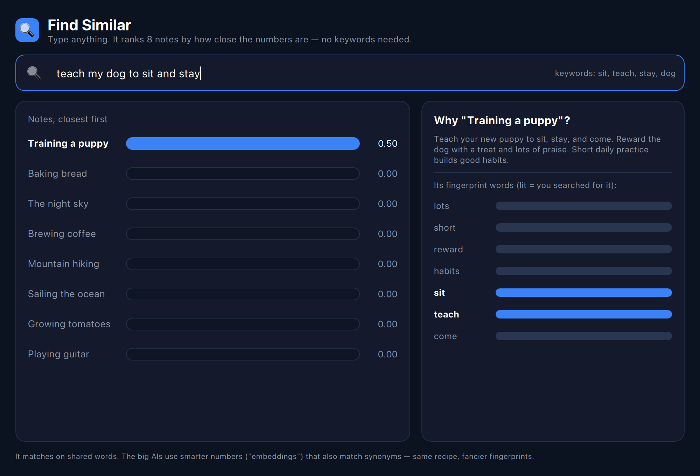
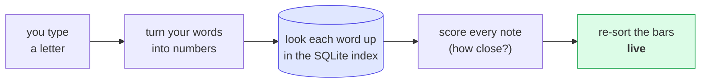

# Find Similar — the interactive app

The **visual version** of the [`findsimilar`](../findsimilar) lesson. Type a search
and watch the notes **re-sort live**, each with a bar showing how close it is — and a
side panel that shows *why* the winner won.

> New to the idea? Read the [`findsimilar` tutorial](../findsimilar/README.md) first —
> this is the same thing with a face on it.



## What you're looking at

- **Left — the results.** Every note, ranked by closeness to what you typed. The bar
  length *is* the similarity score. As you type more, they re-sort in real time.
- **Right — why it matched.** The winning note's own "fingerprint" words. The ones you
  actually searched for are **lit up** — so you can see exactly which words pulled it up.
- **Top — keywords.** The words from your search that count (filler words are dropped).

Type `stars at night` and *The night sky* jumps to the top. Type `a warm morning drink`
and *Brewing coffee* wins. Nothing understands the words — it's just matching numbers.

## How each keystroke flows



## Run it

```bash
cd findsimilar-app
qmake && make
./findsimilarapp
```

(Needs Qt 5.15 or 6 with QML, and the sibling [`qivot`](../../qivot) repo next door.)

## How it's built

- [`searchmodel.h`](searchmodel.h) / [`searchmodel.cpp`](searchmodel.cpp) — the backend.
  It builds the index into SQLite once, then on every keystroke turns your text into
  numbers and ranks the notes. The lookup is a real query:
  `QiQuery<Term>().filter(QiWhere("word = ", w)).all()`.
- [`main.qml`](main.qml) — the window. It only reads `search.results`, `search.keywords`,
  and `search.bestWords` and animates the bars. No logic here.

Same lesson as the terminal version — turn things into numbers, measure closeness — just
something you can *watch happen*.
