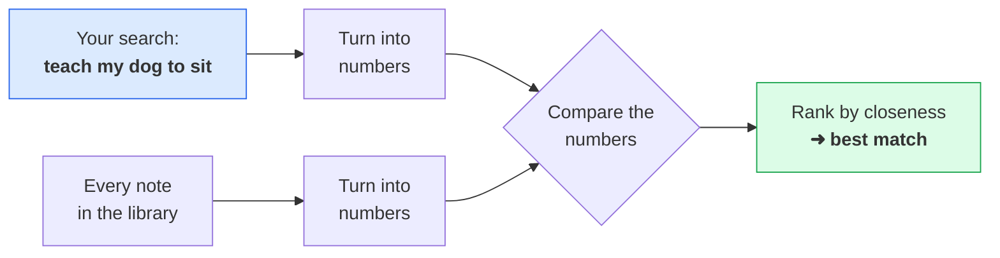
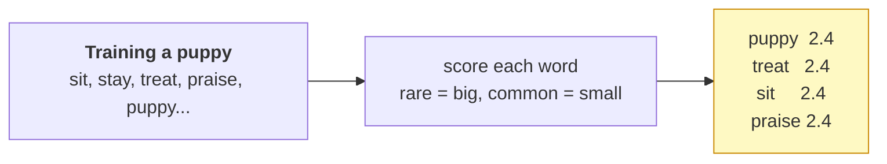
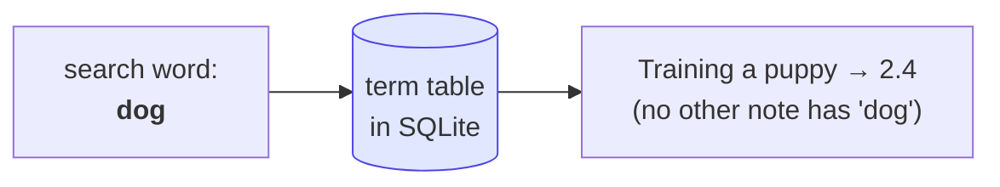

# Find Similar — how an AI "looks things up"

When you ask an AI assistant a question, it feels like it *understands* you. A huge
part of that magic is one simple trick:

> **Turn everything into numbers, then find the numbers that are closest.**
> Close numbers = similar meaning.

That's it. No understanding, no magic — just measuring distance between numbers. This
little program does exactly that, and **shows you every step on screen**.

---

## The whole idea in one picture



Both your question **and** every note get turned into numbers the *same way*. Then we
just see whose numbers line up best.

---

## Step 1 — A library of notes

We start with eight short notes, each about a different thing:

```
[1] Training a puppy     [2] Baking bread       [3] The night sky
[4] Brewing coffee       [5] Mountain hiking    [6] Sailing the ocean
[7] Growing tomatoes     [8] Playing guitar
```

## Step 2 — Turn each note into numbers (a "fingerprint")

A computer can't read words, so we score each word in a note. The clever bit: a word
that shows up in *lots* of notes (like "water") is common and boring, so it gets a
**small** score. A word that's special to one note (like "puppy" or "telescope") gets
a **big** one. Those scores are the note's fingerprint.



On screen it looks like this — each word as a bar (longer = more special to this note):

```
     puppy        ████████████████████  2.4
     treat        ████████████████████  2.4
     stay         ████████████████████  2.4
     praise       ████████████████████  2.4
```

## Step 3 — Turn your search into numbers too

Your search goes through the **exact same** process. Filler words (the, my, to, and…)
are thrown away, and what's left becomes numbers:

```
Your search:  "teach my dog to sit and stay"
keywords that matter:  teach, dog, sit, stay
```

## Step 4 — Compare, and rank by closeness

Now we measure how well your fingerprint lines up with each note's fingerprint, and
sort. Longer bar = closer match:

```
 >> Training a puppy      ██████████████████████████  0.50
    Baking bread          ░░░░░░░░░░░░░░░░░░░░░░░░░░  0.00
    The night sky         ░░░░░░░░░░░░░░░░░░░░░░░░░░  0.00
    Brewing coffee        ░░░░░░░░░░░░░░░░░░░░░░░░░░  0.00
    ...
```

The puppy note wins — not because the computer knows what a dog is, but because its
numbers were the closest. **That's the whole secret behind AI search.**

---

## Run it

```bash
cd findsimilar
qmake && make
./findsimilar                              # a default search
./findsimilar stars and planets at night   # your own words  -> "The night sky"
./findsimilar a warm morning drink         #                 -> "Brewing coffee"
./findsimilar wind waves and the boat      #                 -> "Sailing the ocean"
```

---

## The database is doing something real: it's a search index

Look at how Step 4 actually finds matches. For each word in your search, it asks the
database *"which notes use this word, and how strongly?"* — and adds up the answers.



That lookup — *word ➜ the notes that contain it* — is called an **inverted index**,
and it's exactly how real search engines (Google, your email search) work under the
hood. Here it's just a table you can open and read:

```bash
sqlite3 findsimilar.db "SELECT word, docId, round(weight,1) FROM term WHERE word='puppy';"
```

---

## The honest part: what the big AIs do differently

This program matches on **shared words**. Search *"hypertension"* and it won't find a
note that only says *"high blood pressure"* — different words, even though they mean
the same thing.

The big AIs fix this with fancier numbers called **embeddings**: instead of one number
per word, they use a long list of numbers that captures *meaning*, learned from reading
enormous amounts of text. So "hypertension" and "high blood pressure" end up with
*close* numbers.

But — and this is the point — **the recipe is identical to what you just saw**: turn
things into numbers, then find the closest ones. You now understand the shape of it.
Embeddings just make Step 2 smarter.

---

## Make it yours

- **Swap the library.** Replace the notes in [`corpus.h`](corpus.h) with your own —
  emails, recipes, journal entries — rebuild, and search them.
- **Watch a word's score.** Add a common word to every note and rerun; its score drops,
  because it stops being special. That "rare = important" idea is called *IDF*.
- **Break it on purpose.** Search for a word that's in none of the notes — you'll get
  all zeros, and see *why* word-matching alone isn't enough (which is what embeddings fix).

---

## What Qivot is doing here

Qivot keeps the "AI" part front and center by handling all the storage in a couple of
lines:

- [`models.h`](models.h) describes two tables — the notes (`Doc`) and the fingerprint
  numbers (`Term`) — as small C++ classes.
- Building the index is just `t.save()` per number. Searching is one line:
  `QiQuery<Term>().filter(QiWhere("word = ", w)).all()` — that's the inverted-index
  lookup.

So the lesson stays about the *idea*, and the database gets out of the way.
