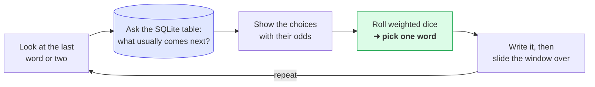

# Guess the Next Word — the interactive app

This is the **visual version** of the [`nextword`](../nextword) lesson. Instead of
reading printed text, you press **Play** and *watch* a tiny language model write —
and, crucially, watch it **think**.

> If you just want the idea explained from scratch, read the
> [`nextword` tutorial](../nextword/README.md) first — this app is the same model
> with a face on it.

```
┌──────────────────────────────┬───────────────────────────┐
│  It writes:                  │  Choosing the word after: │
│                              │  "the little"             │
│  The little boat sails on    │  ─────────────────────    │
│  the calm sea. The cat       │  boat   ██████████  64%   │  ← picked
│  sleeps in the sun. The▊     │  boat   █████       28%   │
│                              │  ...                      │
├──────────────────────────────┴───────────────────────────┤
│  ▶ Play   Step   Reset      Temperature ──●──  Speed ──●─ │
└───────────────────────────────────────────────────────────┘
```

## What you're looking at

The window has two halves that update on every word:

- **Left — "It writes"**: the sentence being built, one word at a time.
- **Right — "Choosing the word after…"**: the handful of words it's picking between
  *right now*, each with a bar showing its odds. The **purple** bar is the one it
  landed on. This is the model "thinking," made visible.

And two dials at the bottom:

- **Temperature** — calm ➜ wild. Low means it almost always takes the most likely
  word (safe, repetitive). High means long-shot words get a real chance (surprising).
- **Speed** — how fast it writes when playing. **Step** does exactly one word so you
  can go at your own pace.

## The loop, in one picture

Every single word follows this cycle:



That's the same trick the huge AI chatbots use — guess the next word, over and over.
The only difference is scale: they weigh tens of thousands of choices using far
fancier numbers. Here you can see all four or five choices, and the whole "brain" is
just a table of counts.

## Run it

```bash
cd nextword-app
qmake && make
./nextwordapp
```

(Needs Qt 5.15 or 6 with QML, and the sibling [`qivot`](../../qivot) repo next door.)

## Things to try

- **Slam Temperature to the left.** Watch it get stuck in safe, repetitive grooves —
  it keeps taking the tallest bar.
- **Slam it to the right.** The writing gets stranger as unlikely words win the dice roll.
- **Use Step, slowly.** Read the right panel before each pick and try to guess which
  word it'll choose. You're doing exactly what the model does.
- **Change the training text** in [`corpus.h`](corpus.h), rebuild, and it writes in a
  whole new voice.

## How it's built (for the curious)

- [`wordmodel.h`](wordmodel.h) / [`wordmodel.cpp`](wordmodel.cpp) — the C++ "brain."
  It trains the counts into SQLite, and each `step()` runs a real query
  (`QiQuery<Gram>().filter(QiWhere("context = ", ctx))`) to fetch the candidates,
  then rolls the weighted dice.
- [`main.qml`](main.qml) — the window. It just reads the brain's properties
  (`brain.text`, `brain.candidates`, `brain.context`) and animates the bars. No logic
  lives here; it's a pure view.
- Qivot stores and serves the model, so the C++ stays about the *idea*.
