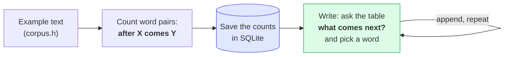
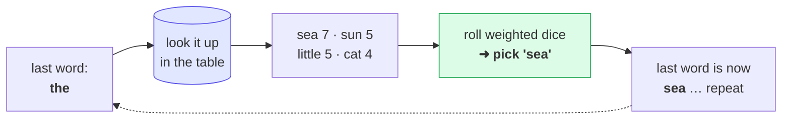

# Guess the Next Word — a tiny "AI" you can actually read

> **Lesson 1 of 4** · [Qivot AI](../README.md) — start here. Next up: [Find Similar](../findsimilar/).

You know how your phone suggests the next word while you're texting? Type *"see you"* and it offers *"soon"*, *"later"*, *"there"*. That's the whole trick behind chatbots too — they just **guess the next word, over and over**, really well.

This little program does the same thing in the simplest way there is. It reads some example text, learns which word tends to come after which, and then writes new sentences by guessing one word at a time. And here's the fun part: its entire "brain" is just **rows in a database file you can open and read**.

No internet. No ChatGPT. No magic. Just counting.

---

## The whole idea in one picture



---

## How it works, in three steps

### 1. It reads and counts

We give it some example text (see [`corpus.h`](corpus.h) — a few sentences about the sea, the sun, a little boat). It goes through the text and tallies: *after this word, which word showed up next, and how many times?*

For example, after the word **"the"**, here's what it counted:

| after… | comes… | how many times |
|--------|--------|:--------------:|
| the | sea | 7 |
| the | sun | 5 |
| the | little | 5 |
| the | cat | 4 |
| the | children | 4 |
| the | waves | 3 |

That table **is** the model. There's nothing else hidden. "Learning" here is literally just keeping score.

### 2. It saves those counts in a database

Each of those rows gets stored in a SQLite table (through Qivot, the database library). After you run it once, there's a real file — `nextword.db` — sitting next to the program. You can open it and look at the "brain" yourself:

```bash
sqlite3 nextword.db "SELECT * FROM gram WHERE context='good night';"
```

```
good night | sea    | 1
good night | cat    | 1
good night | little | 1
good night | sun    | 1
```

So after *"good night"*, it's a genuine four-way toss-up between *sea*, *cat*, *little (boat)*, and *sun* — because in the example text, all four happened once.

### 3. It writes by guessing, one word at a time

To write a sentence, it starts fresh, looks at the last word or two, asks the database *"what usually comes next?"*, and rolls weighted dice to pick one. Words it saw more often are more likely to get picked — but not guaranteed, which is why it doesn't just repeat the original text word-for-word. Then it repeats, using the word it just picked, and keeps going.



That's it. Read → count → save → roll the dice. That loop, made enormously bigger and fancier, is the same idea behind the big AI chatbots.

---

## Run it

You'll need Qt (5.15 or 6) and the sibling [`qivot`](../../qivot) repo checked out next to this one.

```bash
cd nextword
qmake && make
./nextword
```

Example output:

```
Learned 309 transitions from 236 words (vocabulary: 67 words).

The old man walks and watches the little boat comes home at night. The old
man walks by the sea. The children play near the sea is calm again. The
gulls fly and call to the wind. The waves roll.
```

Not bad for a program whose whole brain is 309 rows in a table!

---

## How it picks a word: weighted dice + a "temperature" knob

When the model looks up "the", it usually finds several options, each with a different count:

```
after "the":   sea 7 · sun 5 · little 5 · cat 4 · waves 3 · ...
```

It doesn't just grab the biggest. It rolls **weighted dice**, in two simple steps:

1. **Give each word a slice of the dice the size of its count.** "sea" (7) gets a bigger slice than
   "waves" (3).
2. **Roll once, and take whichever slice you land on.** So "sea" wins most often — but "waves" still
   comes up sometimes. That little bit of chance is why the writing isn't identical every run.

### The temperature knob

Temperature just reshapes those slices *before* the roll:

- **Low (0.4) — "play it safe."** It stretches the differences: big slices get even bigger, small ones
  nearly vanish. It almost always takes the most common word → predictable, repetitive.
- **High (1.6) — "get adventurous."** It flattens the slices toward equal, so rare words get a real
  chance → surprising, sometimes weird.
- **1.0** leaves the slices exactly as the counts say.

```bash
./nextword 40 0.4     # calm — sticks to the safe, common choices
./nextword 40 1.0     # normal
./nextword 40 1.6     # wild — takes more surprising turns
```

In code it's one line — raise each count to a power set by the temperature, then roll:

```cpp
weight = pow(count, 1.0 / temperature);   // low temp → big gaps; high temp → nearly flat
```

Real chatbots have this exact same dial. Turn it down for a factual answer, up for a creative one.

---

## Make it yours (things to try)

- **Feed it your own words.** Replace the text in [`corpus.h`](corpus.h) with song lyrics, a recipe, your own notes — rebuild, and it'll babble in that style. More text = better output.
- **Look further back.** In [`main.cpp`](main.cpp), change `ORDER` from `2` to `1` and rebuild. Now it only looks at the *last one* word instead of the last two — the writing gets more random and less coherent. Bump it to `3` (with enough text) and it gets more coherent but repeats the source more.
- **Peek at the brain.** Open `nextword.db` with any SQLite tool and browse the `gram` table. Sort by `n` to see the model's favorite word pairings.

---

## What Qivot is doing here

Qivot is the part that turns the counts into a real, saved database with almost no code:

- [`model.h`](model.h) — describes one row (`context`, `word`, `n`) as a small C++ class. That one description is enough for Qivot to create the table.
- In [`main.cpp`](main.cpp), saving a row is just `g.save()`, and asking "what comes after this context?" is one line: `QiQuery<Gram>().filter(QiWhere("context = ", ctx)).all()`.

So the "AI" idea stays front and center, and the database plumbing stays out of the way. That's the whole point of this project.
