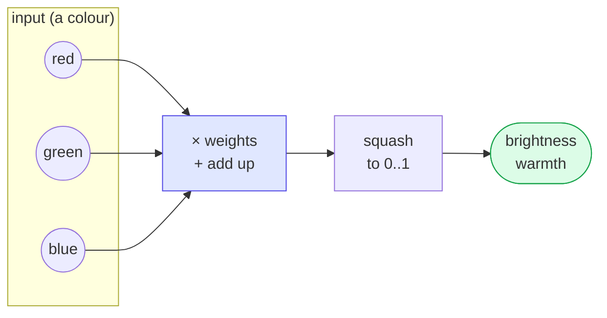

# Tensors — the interactive app

The **visual version** of the [`tensor`](../tensor) lesson. Drag the red / green / blue
sliders and watch **one neural-network layer compute in real time** — the input numbers,
the weight grid, the multiply-and-add, and the output numbers all update as you move.

> Want the idea explained from scratch first? Read the
> [`tensor` tutorial](../tensor/README.md) — this is the same layer, made hands-on.

```
┌────────────────────────────┬──────────────────────────────────────┐
│ 1 · Pick a colour          │ 2 · The weight grid (2×3, from SQLite) │
│  ▉▉▉▉ swatch                │             red    green   blue        │
│  Red   ───●───  240         │  brightness +0.30  +0.59  +0.11        │
│  Green ──●────  150         │  warmth     +0.90  +0.00  -0.90        │
│  Blue  ●──────   60         │ 3 · Multiply, add, squash              │
│  as numbers (0..1):        │  brightness = 0.94×0.30 + … = 0.79     │
│  red   ██████████ 0.94     │  brightness ███████████████ 0.69       │
│  ...                       │  warmth     ██████████████░ 0.66       │
└────────────────────────────┴──────────────────────────────────────┘
```

## What you're looking at

- **Left — the input.** A colour swatch you mix with three sliders, then the same
  colour shown as three numbers scaled to 0..1 (that's the "input vector").
- **Right — the layer.** First the **weight grid** (green cells = positive weights,
  red = negative), read live from the SQLite table. Then the actual arithmetic for each
  output, and a bar for the final squashed number.

Slide **Blue** up and watch **warmth** drop — because its weight for blue is negative
(-0.90). You're watching a neural layer "decide," and every number is on screen.

## The one move, visualised



## Run it

```bash
cd tensor-app
qmake && make
./tensorapp
```

(Needs Qt 5.15 or 6 with QML, and the sibling [`qivot`](../../qivot) repo next door.)

## How it's built

- [`layer.h`](layer.h) / [`layer.cpp`](layer.cpp) — the backend. It loads the weight grid
  from SQLite (`QiQuery<Weight>()…`), and on every slider move recomputes the outputs and
  hands QML each intermediate value.
- [`main.qml`](main.qml) — the window. It just draws `net.inputs`, `net.outputs`, and the
  weight cells; no math lives here.

Same lesson as the terminal version — *a neural layer is multiply-by-a-grid-then-squash* —
but now you can feel it by dragging.
