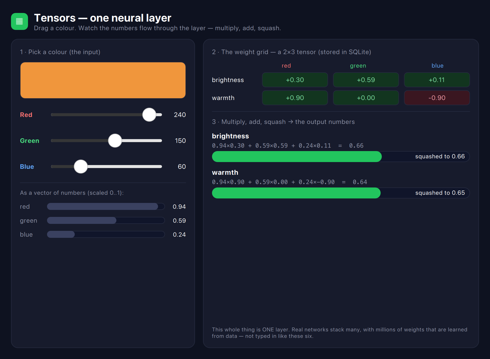

# Tensors — the interactive app

The **visual version** of the [`tensor`](../tensor) lesson. Drag the red / green / blue
sliders and watch **one neural-network layer compute in real time** — the input numbers,
the weight grid, the multiply-and-add, and the output numbers all update as you move.

> Want the idea explained from scratch first? Read the
> [`tensor` tutorial](../tensor/README.md) — this is the same layer, made hands-on.



## What you're looking at

- **Left — the input.** A colour swatch you mix with three sliders, then the same
  colour shown as three numbers scaled to 0..1 (that's the "input vector").
- **Right — the layer.** First the **weight grid** (green cells = positive weights,
  red = negative), read live from the SQLite table. Then the actual arithmetic for each
  output, and a bar for the final squashed number.

Slide **Blue** up and watch **warmth** drop — because its weight for blue is negative
(-0.90). You're watching a neural layer "decide," and every number is on screen.

## The one move, visualised


## Run it

```bash
cd tensor-app
qmake && make
./tensorapp
```

(Needs Qt 5.15 or 6 with QML, and the sibling [`qivot`](../../qivot) repo next door.)

## The code behind it, step by step

The window has no math in it — it just draws numbers. All the work is in the C++ backend
[`layer.cpp`](layer.cpp). Here's the real code, in the order it runs.

### Step 1 — When the app starts, read the weights out of SQLite

```cpp
void Layer::load() {
    for (int o = 0; o < 2; o++) {                       // each output neuron
        for (int i = 0; i < 3; i++) {                   // each input (r,g,b)
            QiList<Weight> wl = QiQuery<Weight>()
                .filter(QiWhere("outIdx = ", o) && QiWhere("inIdx = ", i)).all();
            m_W[o][i] = wl.size() > 0 ? double(wl.at(0)->value) : 0.0;
        }
    }
    recompute();                                        // compute the first result
}
```

It fills a plain `m_W[2][3]` array by **querying the database** cell by cell — the weight
grid literally comes out of SQLite.

### Step 2 — Every time a slider moves, recompute

A slider is bound to a property. Moving it calls `setRed`, which re-runs the layer:

```cpp
void Layer::setRed(int v) {
    v = qBound(0, v, 255);
    if (v == m_r) return;
    m_r = v;
    recompute();          // do the math again
    emit changed();       // tell QML to redraw
}
```

### Step 3 — The layer math (same three moves as the terminal lesson)

```cpp
const double x[3] = { m_r/255.0, m_g/255.0, m_b/255.0 };   // colour → 0..1 input

for (int o = 0; o < 2; o++) {
    double sum = m_bias[o];
    for (int i = 0; i < 3; i++)
        sum += m_W[o][i] * x[i];        // multiply each input by its weight, add up
    // ... then squash(sum) into 0..1 and stash it for QML to draw
}
```

That inner loop is the neural layer — the *exact* code from the terminal
[`tensor`](../tensor) lesson, just wrapped so a slider can re-run it live.

### Step 4 — Hand the numbers to QML

`recompute()` packs the inputs and outputs into lists the window reads:

```cpp
Q_PROPERTY(QVariantList inputs  READ inputs  NOTIFY changed)
Q_PROPERTY(QVariantList outputs READ outputs NOTIFY changed)
```

The QML in [`main.qml`](main.qml) just binds to `net.inputs` and `net.outputs` and animates
the bars — no logic there at all.

> **A gotcha worth knowing:** the C++ object is exposed to QML as **`net`**, not `layer`.
> Every QML `Item` already has a built-in `layer` property (for graphics effects), so a
> context object named `layer` gets shadowed and silently reads as `undefined`. Renaming it
> to `net` fixed it.

Same lesson as the terminal version — *a neural layer is multiply-by-a-grid-then-squash* —
but now you can feel it by dragging.
