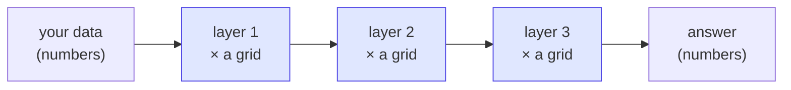

# Tensors — the numbers AI is made of

People say neural networks are complicated. The *data* inside them isn't. It's all
just **tensors** — a fancy word for **a box of numbers**:

| name | what it is | example |
|------|-----------|---------|
| scalar | one number | `5` |
| vector | a row of numbers | `[220, 180, 90]` (a color) |
| matrix | a grid of numbers | the weight grid below |
| (bigger) | a stack of grids | an image, a batch… |

And a neural network really only does **one move**, over and over:

> take your numbers → **multiply them by a grid of weights** → add a nudge → squash the result.

That single move is called a **layer**. This program runs exactly one layer and shows
every number along the way.

---

## The example

We turn a **color** (3 numbers: red, green, blue) into **2 new numbers** we've named
*brightness* and *warmth*. That's it — that's a neural layer.


Every input connects to every output. The **strength** of each connection is a weight —
and all those weights together form the grid (the matrix). Here it's a 2×3 grid:

```
                 red     green    blue
     brightness  0.30    0.59    0.11     ← how much each color means "bright"
     warmth      0.90    0.00   -0.90     ← red adds warmth, blue takes it away
```

> **Important honesty:** we picked these weights by hand so you can read them. A real
> network **learns** them automatically from thousands of examples. But the math it
> runs afterward is *exactly* what you see here — nothing more exotic.

---

## Watch it run, step by step

```
STEP 1 - Your input color as a vector (a blue: 30, 90, 200 → scaled to 0..1)
     red    ███░░░░░░░░░░░░░░░░░░░  0.12
     green  ████████░░░░░░░░░░░░░░  0.35
     blue   █████████████████░░░░░  0.78

STEP 3 - Multiply the input by each row, and add them up
     brightness = 0.12*0.30 + 0.35*0.59 + 0.78*0.11  =  0.33
     warmth     = 0.12*0.90 + 0.35*0.00 + 0.78*-0.90 = -0.60   ← blue → not warm

STEP 4 - Squash to 0..1 → the layer's output
     brightness █████████████░░░░░░░░░  0.58
     warmth     ████████░░░░░░░░░░░░░░  0.35
```

A blue color comes out **low on warmth** — exactly what the weights say should happen.

---

## Run it

```bash
cd tensor
qmake && make
./tensor                 # a default orange
./tensor 30 90 200       # a blue        → warmth drops
./tensor 250 250 250     # near white     → both high
./tensor 255 40 20       # strong red     → warmth near max
```

---

## Why this is the whole ballgame

Modern AI is this same step, stacked and scaled:



- A chatbot has **billions** of these weights instead of six.
- The grids are far bigger, and there are many layers.
- And crucially, the weights are **learned**, not hand-set.

But peel all that back and each layer is doing what you just watched: *multiply numbers
by a grid, add, squash*. Once that clicks, the mystery of "how does AI compute anything"
is basically solved.

---

## What Qivot is doing here

The weight grid and biases are stored as ordinary rows (see [`models.h`](models.h)) — a
`weight` table with `(outIdx, inIdx, value)` and a `bias` table. Reading a weight back
is one line: `QiQuery<Weight>().filter(QiWhere("outIdx = ", o) && QiWhere("inIdx = ", i))`.
So "the model's knowledge" is something you can literally open and inspect:

```bash
sqlite3 tensor.db "SELECT outIdx, inIdx, value FROM weight;"
```

That's the same idea across this whole project: an AI "model" is just numbers in a table.
