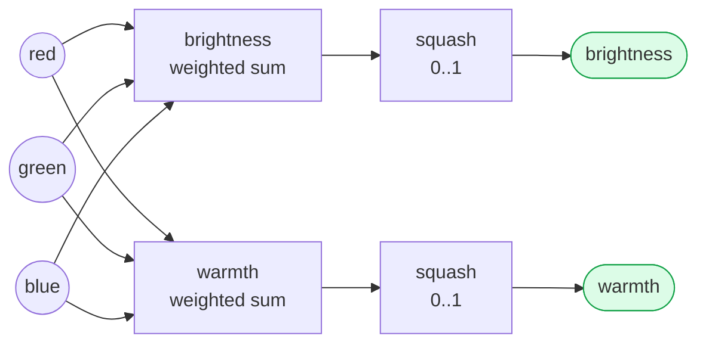
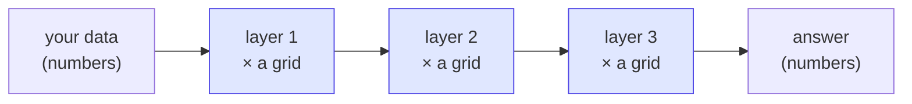

# Tensors — the numbers AI is made of

> **Lesson 3 of 4** · [Qivot AI](../README.md) — builds on the number-lists from [findsimilar](../findsimilar/). Next: [Sort into Buckets](../classify/).

People say neural networks are complicated. The *data* inside them isn't. It's all
just **tensors** — a fancy word for **a box of numbers**:

| name | what it is | example |
|------|-----------|---------|
| scalar | one number | `5` |
| vector | a row of numbers | `[220, 180, 90]` (a color) |
| matrix | a grid of numbers | the weight grid below |
| (bigger) | a stack of grids | an image, a batch… |

And a neural network really only does **one move**, over and over:

> take your numbers → **multiply them by a grid of weights** → add a nudge → squash the result.

That single move is called a **layer**. This program runs exactly one layer and shows
every number along the way.

---

## The example

We turn a **color** (3 numbers: red, green, blue) into **2 new numbers** we've named
*brightness* and *warmth*. That's it — that's a neural layer.



Every input connects to every output. The **strength** of each connection is a weight —
and all those weights together form the grid (the matrix). Here it's a 2×3 grid:

```
                 red     green    blue
     brightness  0.30    0.59    0.11     ← how much each color means "bright"
     warmth      0.90    0.00   -0.90     ← red adds warmth, blue takes it away
```

> **Important honesty:** we picked these weights by hand so you can read them. A real
> network **learns** them automatically from thousands of examples. But the math it
> runs afterward is *exactly* what you see here — nothing more exotic.

---

## Watch it run, step by step

```
STEP 1 - Your input color as a vector (a blue: 30, 90, 200 → scaled to 0..1)
     red    ███░░░░░░░░░░░░░░░░░░░  0.12
     green  ████████░░░░░░░░░░░░░░  0.35
     blue   █████████████████░░░░░  0.78

STEP 3 - Multiply the input by each row, and add them up
     brightness = 0.12*0.30 + 0.35*0.59 + 0.78*0.11  =  0.33
     warmth     = 0.12*0.90 + 0.35*0.00 + 0.78*-0.90 = -0.60   ← blue → not warm

STEP 4 - Squash to 0..1 → the layer's output
     brightness █████████████░░░░░░░░░  0.58
     warmth     ████████░░░░░░░░░░░░░░  0.35
```

A blue color comes out **low on warmth** — exactly what the weights say should happen.

---

## Run it

```bash
cd tensor
qmake && make
./tensor                 # a default orange
./tensor 30 90 200       # a blue        → warmth drops
./tensor 250 250 250     # near white     → both high
./tensor 255 40 20       # strong red     → warmth near max
```

---

## The Qt/C++ code, step by step

Here is the whole program, in the order it runs. Every snippet is **real code from this
folder** — [`models.h`](models.h) and [`main.cpp`](main.cpp) — nothing hidden.

### Step 0 — Describe the weight grid as a table

We don't hand-write any SQL. We describe *one row* of the grid as a small C++ class, and
Qivot turns it into a database table for us ([`models.h`](models.h)):

```cpp
class Weight : public QiModel {
    QI_MODEL
public:
    QiField<int>    outIdx;   // which output neuron (0 = brightness, 1 = warmth)
    QiField<int>    inIdx;    // which input        (0 = red, 1 = green, 2 = blue)
    QiField<double> value;    // the weight number itself
};
QI_DECLARE_MODEL(Weight, "weight",
    QI_FIELD(outIdx), QI_FIELD(inIdx), QI_FIELD(value));
```

Each **row** is one number in the grid: its position (`outIdx`, `inIdx`) and its `value`.
A 2×3 grid is just 6 rows. (There's a matching `Bias` class for the nudges.)

### Step 1 — Open the database

```cpp
QSqlDatabase db = QSqlDatabase::addDatabase("QSQLITE");
db.setDatabaseName("tensor.db");            // a real file on disk
db.open();

QiConnection connection;
connection.open(db);
connection.addModel<Weight>();              // "here are my tables"
connection.addModel<Bias>();
connection.createTables();                  // builds them from the class descriptions
```

### Step 2 — Store the weights (the network's "knowledge")

```cpp
const double W[2][3] = { { 0.30, 0.59, 0.11 },      // brightness row
                         { 0.90, 0.00, -0.90 } };   // warmth row
QiTransaction tx;                                    // batch the writes = fast
for (int o = 0; o < 2; o++) {
    for (int i = 0; i < 3; i++) {
        Weight w; w.outIdx = o; w.inIdx = i; w.value = W[o][i];
        w.save();                                    // <-- inserts one row
    }
}
tx.commit();
```

`w.save()` writes a single row. After this loop the `weight` table holds all six numbers —
you could open `tensor.db` right now and read them. (A real network would *learn* these
values from data instead of us typing them.)

### Step 3 — Turn the input colour into numbers

```cpp
const double x[3] = { R / 255.0, G / 255.0, B / 255.0 };   // scale 0..255 → 0..1
```

That's the input **vector** — three numbers between 0 and 1.

### Step 4 — Read a weight back out of the database

```cpp
QiList<Weight> wl = QiQuery<Weight>()
    .filter(QiWhere("outIdx = ", o) && QiWhere("inIdx = ", i))
    .all();
const double v = wl.size() > 0 ? double(wl.at(0)->value) : 0.0;
```

This asks the table for the weight at grid position `(o, i)`. It's the same kind of query
the search lesson uses — proof that the "model" genuinely lives in SQLite, not in the code.

### Step 5 — The layer's math: multiply, then add

```cpp
double sum = Bs[o];                    // start with the bias nudge (Bs = biases)
for (int i = 0; i < 3; i++)
    sum += W[o][i] * x[i];             // each input × its weight, summed up
```

**This loop is the neural layer.** One output = every input times its weight, added
together. Two outputs (brightness, warmth) → we run it twice.

### Step 6 — Squash the result (the "activation")

```cpp
static double squash(double z) {
    return 1.0 / (1.0 + std::exp(-z));   // turns ANY number into one between 0 and 1
}
...
const double y = squash(sum);            // the final output number
```

The raw sum could be any size, so `squash` (a sigmoid) folds it into a tidy 0..1 range.
That squasher is the "activation function" you hear people mention.

**That's the entire program:** describe tables → store weights → read the input →
multiply-and-add → squash. Six numbers, one loop, and one `exp()`. Everything else in AI
is this exact shape, just far bigger.

---

## Why this is the whole ballgame

Modern AI is this same step, stacked and scaled:



- A chatbot has **billions** of these weights instead of six.
- The grids are far bigger, and there are many layers.
- And crucially, the weights are **learned**, not hand-set.

But peel all that back and each layer is doing what you just watched: *multiply numbers
by a grid, add, squash*. Once that clicks, the mystery of "how does AI compute anything"
is basically solved.

---

## What Qivot is doing here

The weight grid and biases are stored as ordinary rows (see [`models.h`](models.h)) — a
`weight` table with `(outIdx, inIdx, value)` and a `bias` table. Reading a weight back
is one line: `QiQuery<Weight>().filter(QiWhere("outIdx = ", o) && QiWhere("inIdx = ", i))`.
So "the model's knowledge" is something you can literally open and inspect:

```bash
sqlite3 tensor.db "SELECT outIdx, inIdx, value FROM weight;"
```

That's the same idea across this whole project: an AI "model" is just numbers in a table.
